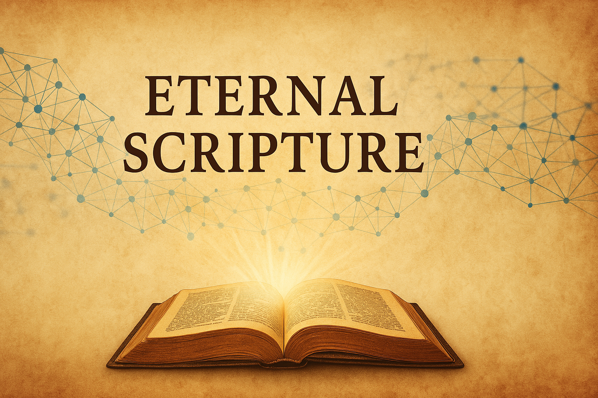

# EternalScripture



**Preserving the Sacred. Forever.**

## Description
EternalScripture is a Web3-based preservation project dedicated to the eternal safeguarding of rare Biblical documents, collectible cards, and spiritual artifacts. By storing their digital copies on IPFS and registering immutable proofs on the blockchain, we ensure that sacred texts, images, and interpretations will never be lost, deleted, or altered — no matter what happens in the physical world.

This project merges faith, technology, and historical memory into a decentralized archive that transcends borders, regimes, and time.

---

## Features
- ✅ Permanent file storage via IPFS
- ✅ Blockchain-anchored content verification
- ✅ NFT-ready metadata structure
- ✅ Open source repository for public transparency
- ✅ Designed for cross-border collaboration and long-term spiritual preservation

---

## Folder Structure
```
eternalscripture/
├── cards/                  # Uploaded card images & files
│   ├── card001.jpg
│   └── card001.json
├── metadata/               # IPFS CIDs and descriptive metadata
│   └── ipfs_registry.json
├── scripts/                # Automation tools
│   └── upload_to_ipfs.py
├── blockchain/             # Smart contract code or blockchain recording scripts
│   └── record_cid.sol
├── README.md
```

---

## Tech Stack
- IPFS (Filecoin / web3.storage or Pinata)
- Ethereum or Polygon Blockchain (L2 for gas efficiency)
- Optionally: Arweave for long-term immutability
- GitHub (Open Source)
- Python / JavaScript for scripting

---

## Example Metadata Files

### `card001.json`
```json
{
  "title": "The Sacrifice of Isaac",
  "origin": "18th century engraving",
  "description": "Depiction of Genesis 22: Abraham prepares to sacrifice his son Isaac in obedience to God.",
  "scripture_reference": "Genesis 22:1–19",
  "language": "Latin",
  "cid": "QmXYZ...",
  "format": "image/jpeg",
  "uploaded_by": "orest.yatskuliak",
  "date_uploaded": "2025-04-01"
}
```

### `card002.json`
```json
{
  "title": "Moses Parting the Red Sea",
  "origin": "French lithograph, 19th century",
  "description": "Artistic representation of Exodus 14:21–31, where Moses parts the sea to lead Israel to safety.",
  "scripture_reference": "Exodus 14:21–31",
  "language": "French",
  "cid": "QmABC...",
  "format": "image/png",
  "uploaded_by": "orest.yatskuliak",
  "date_uploaded": "2025-04-01"
}
```

### `card003.json`
```json
{
  "title": "The Last Supper",
  "origin": "Italian woodcut, Renaissance period",
  "description": "An intricate woodcut of Jesus' final meal with His disciples as told in the Gospels.",
  "scripture_reference": "Luke 22:7–20",
  "language": "Italian",
  "cid": "QmLMN...",
  "format": "image/jpeg",
  "uploaded_by": "orest.yatskuliak",
  "date_uploaded": "2025-04-01"
}
```

---

## Upload Script (`scripts/upload_to_ipfs.py`)
```python
import os
import json
import requests

API_TOKEN = "your_web3_storage_token"
API_URL = "https://api.web3.storage/upload"
HEADERS = {"Authorization": f"Bearer {API_TOKEN}"}

files = [f for f in os.listdir("../cards") if f.endswith(".jpg") or f.endswith(".png")]

for file_name in files:
    with open(f"../cards/{file_name}", "rb") as f:
        response = requests.post(API_URL, headers=HEADERS, files={"file": f})
        if response.ok:
            cid = response.json()["cid"]
            print(f"Uploaded {file_name} -> CID: {cid}")
        else:
            print(f"Failed to upload {file_name}: {response.text}")
```

---

## Mission & Vision
To protect the spiritual, cultural, and historical legacy of the Bible using modern decentralized technologies, ensuring that sacred knowledge remains uncorrupted, uncensored, and eternally accessible.

> "Heaven and earth will pass away, but my words will never pass away." – Matthew 24:35

---

## Roadmap
### Q2 2025
- [x] Project structure and vision defined
- [ ] Upload first batch of 10–20 cards to IPFS
- [ ] Record CID entries on-chain (Polygon or Arweave)
- [ ] Public repository launch on GitHub

### Q3 2025
- [ ] Build lightweight web interface for collection browsing
- [ ] Begin outreach to spiritual archivists and researchers
- [ ] Launch first community NFT drop (optional)

---

## Status
✅ Project in early development. First batch of artifacts is being digitized and prepared for IPFS upload.

---

## License
MIT License (or custom spiritual preservation clause — TBD)

---

## Contact
For collaboration, spiritual contribution, or technical support:
📧 eternalscripture@proton.me
